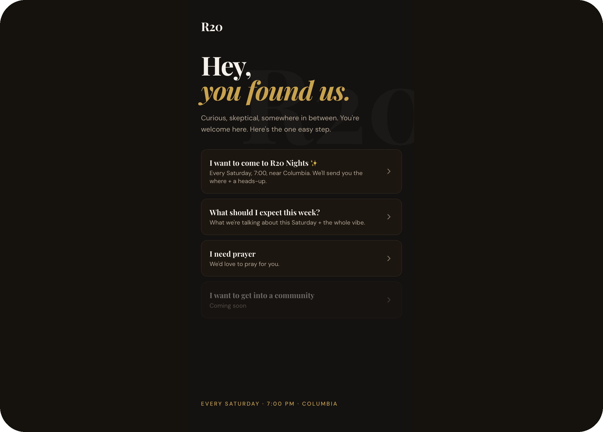
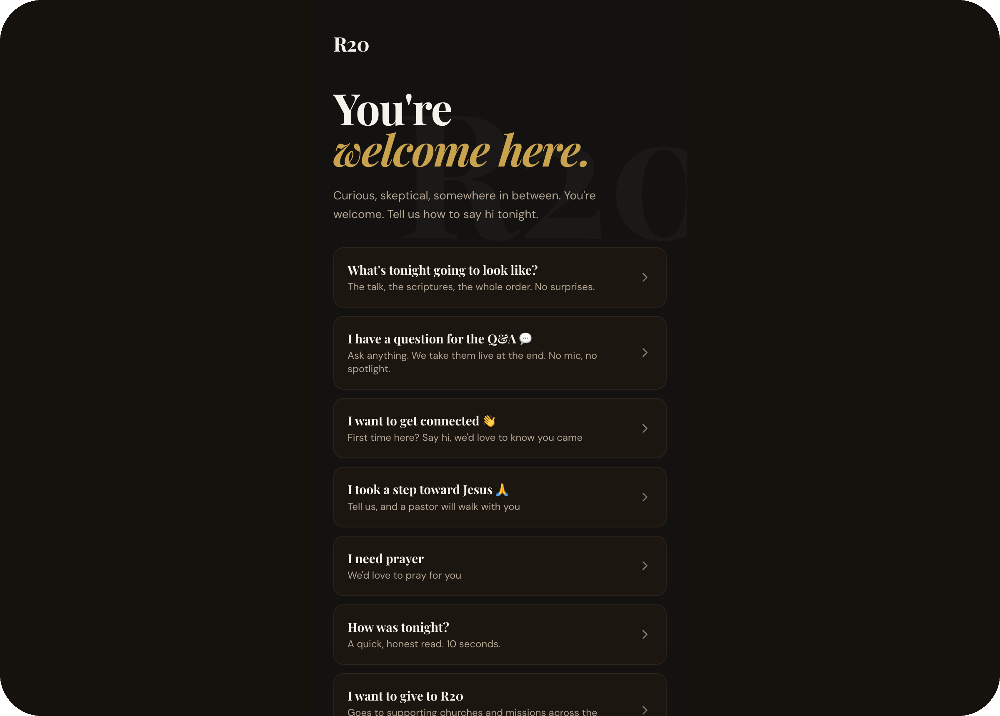
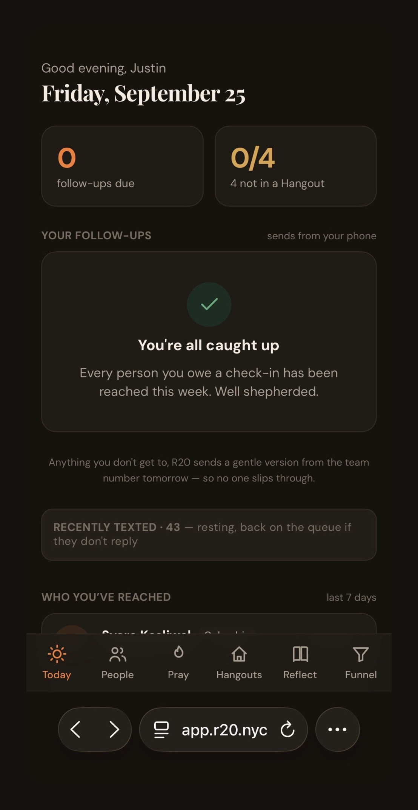
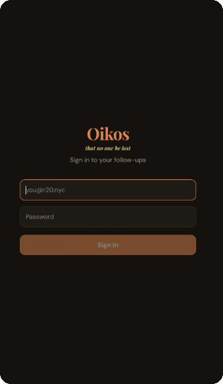
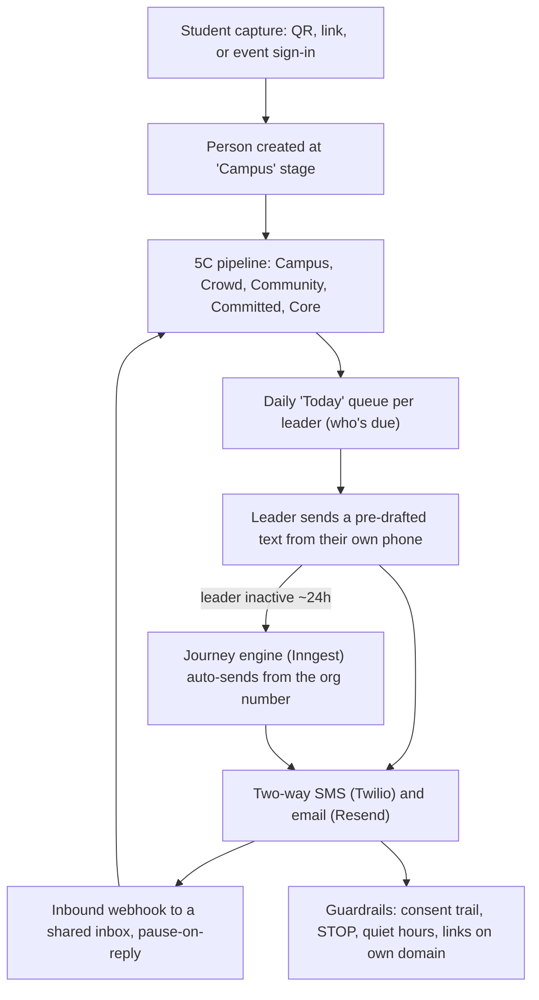

# R20 Reach


A relationship-first outreach and discipleship-pipeline platform for a multi-campus college ministry (Columbia, NYU, CCNY, Pace).

> **About this repository**
> This is a **sanitized public showcase** of a private production application. Real member data, personal contact details, credentials, and internal operations documents have been removed, and the sample data is synthetic. It exists to demonstrate the engineering — not to run the live ministry.

---

## Screenshots

The student-facing capture surfaces (mobile-first, install-nothing). The leader/admin app sits behind auth.

<table>
  <tr>
    <td align="center">Cold landing (<code>/welcome</code>)</td>
    <td align="center">Ways to say hi (<code>/hi</code>)</td>
  </tr>
  <tr>
    <td align="center"></td>
    <td align="center"></td>
  </tr>
  <tr>
    <td align="center">Leader home (<code>Today</code>)</td>
    <td align="center">Leader sign-in (<code>/login</code>)</td>
  </tr>
  <tr>
    <td align="center"></td>
    <td align="center"></td>
  </tr>
</table>

## What it is

Three products in one codebase:

1. **A follow-up / touchpoint engine** — two-way SMS + email with automated, durable "journeys," a shared inbox, and consent compliance baked in.
2. **A discipleship pipeline** — a five-stage funnel (Campus → Crowd → Community → Committed → Core) where *placement into a small group* is the leading metric, not raw contact counts.
3. **A leader operating system** — each leader gets a daily "Today" queue of who to reach out to, with a pre-drafted message they send from their own phone in one tap.

One codebase serves three surfaces: mobile-first for leaders, desktop for admins, and an install-nothing web capture flow for students.

## How it works

A student is captured once (a QR at an event, a link, or a sign-in). From there the system tracks them through the funnel and puts the *next relationship* in front of the right leader every day — never a mass blast.



The **"who's due today" logic** and the **send-window / quiet-hours math** are the heart of the system and live as pure, unit-tested functions in `src/lib` — independent of the database and framework.

## Stack

- **Next.js** (App Router, PWA) + **React 19** + **Tailwind**
- **Supabase** (Postgres, Auth, Row-Level Security, Realtime)
- **Inngest** for durable, scheduled message journeys
- **Twilio** (SMS) and **Resend** (email)
- **Anthropic SDK** for an opt-in, safety-gated counseling-assist feature
- **Vercel** for hosting
- TypeScript end to end (~17k lines)

## Architecture highlights

- **`src/lib/`** — the domain core, framework-free and unit-tested: the funnel model, the "who's due today" queue logic, event/invite routing, SMS composition, de-identification, and the journey engine.
- **`src/app/`** — Next.js routes and server actions; server actions enforce authorization server-side (the UI is never trusted).
- **`supabase/migrations/`** — the full Postgres data model as incremental migrations, with synthetic seed data for local development.
- **`tests/`** — unit tests for the pure core: the "who's due" queue logic, send-window/quiet-hours math, event/invite routing, and phone + formatting helpers.

### Design decisions worth calling out

- **Relationship-first, not mass automation.** The unit of the system is *one leader ↔ one friend*. There is deliberately no "blast everyone" button; outreach is drafted for a person and sent by a human.
- **Reliability without a robotic feel.** The app owns the leader's *memory and composition*: it drafts a warm follow-up, the leader one-taps send from their own number, and if the leader goes inactive the org number auto-sends after ~24h so nothing falls through.
- **Compliance built in, not bolted on.** Pause-on-reply, recipient-local quiet hours, a consent audit trail, STOP handling everywhere, and links restricted to the ministry's own domain.
- **Responsible AI.** The counseling-assist feature coaches the *leader*, never diagnoses the member. Member-identifying content is de-identified before any model call, a deterministic crisis check always surfaces a referral regardless of model output, and the whole feature stays dark behind a flag until legal/pastoral gates clear.

## Local development

```bash
npm install
cp .env.example .env.local   # fill in your own Supabase (and optional Twilio/Resend) keys
npm run dev
```

Apply the schema to a Postgres/Supabase database using the files in `supabase/migrations/` (in order). The seed migration loads synthetic demo data so the app is usable immediately.

```bash
npm test          # run the unit tests
npm run build     # production build
```

## Authors

A collaboration between **[Ekow Bentsi-Enchill](https://github.com/ekowbe)** and **[Justin Oketunmbi](https://github.com/DaPillah)**.

## License

Source-available for **viewing and evaluation only** — all rights reserved. No reuse
without written permission. See [LICENSE](./LICENSE).
